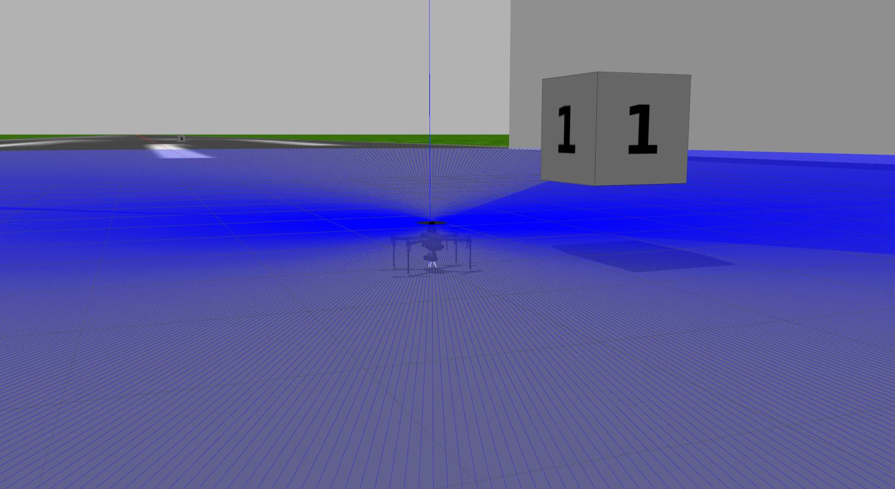

# Quadcopter-Sim
 A guidance and control project for controlling a quadcopter.
 In this project he task that the quadcopter is required to perform are as mentioned below:
 1. Moving from point A to point B Autonomously.
 2. Using the simplest way to achieve the desired goal.
 3. The waypoint information will be given from the GroundControlStation.
 4. The video from the quadcopter has to be streamed back to the base station.
 
 A diagram showing the waypoints (in stars) and obstacle (thick lines) is shown for kind reference.
 

So before we even start this custom controller, we have to install some required components for the smooth funcioning of the controller and the simulation.

# Required Components:

- ROS(Robot Operating System)
- Gazebo
- Ardupilot
- MAVProxy
- QGroundControlStation
- Webserver Video Streamer
- Gazebo World

Now we will install these above components in a specific order for the code to run.

# Install ROS and Setup Catkin  

In this tutorial we are using **Ubuntu 18.04** and **ROS Melodic**

Code blocks are meant to be typed in Terminal windows. "Control+Alt+T" opens a new Terminal window.

## 1. Install ROS and Gazebo

   - Do _Desktop-full Install_
   - Follow until _Step 1.7_ at the end of the page

   First, install **ROS Melodic** using the following instructions: http://wiki.ros.org/melodic/Installation/Ubuntu


## 2. Set Up Catkin workspace

We use `catkin build` instead of `catkin_make`. Please install the following:
```bash
sudo apt-get install python-wstool python-rosinstall-generator python-catkin-tools
```

Then, initialize the catkin workspace:
```bash
mkdir -p ~/catkin_ws/src
cd ~/catkin_ws
catkin init
```

## 3. Dependencies installation

Install `mavros` and `mavlink` from source:
```bash
cd ~/catkin_ws
wstool init ~/catkin_ws/src

rosinstall_generator --upstream mavros | tee /tmp/mavros.rosinstall
rosinstall_generator mavlink | tee -a /tmp/mavros.rosinstall
wstool merge -t src /tmp/mavros.rosinstall
wstool update -t src
rosdep install --from-paths src --ignore-src --rosdistro `echo $ROS_DISTRO` -y

catkin build
```
Add a line to end of `~/.bashrc` by running the following command:
```bash
echo "source ~/catkin_ws/devel/setup.bash" >> ~/.bashrc
```

update global variables
```bash
source ~/.bashrc
```

install geographiclib dependancy 
```bash
sudo ~/catkin_ws/src/mavros/mavros/scripts/install_geographiclib_datasets.sh
```


## 4. Clone IQ Simulation ROS package 

```bash
cd ~/catkin_ws/src
git clone https://github.com/vi-ku/iq_sim.git
git clone https://github.com/vi-ku/iq_gnc.git
```
Our repository should now be copied to `~/catkin_ws/src/iq_sim/` (don't run this line. This is just saying that if you browse in the file manager, you will see those folders).

run the following to tell gazebo where to look for the iq models 
```
echo "GAZEBO_MODEL_PATH=${GAZEBO_MODEL_PATH}:$HOME/catkin_ws/src/iq_sim/models" >> ~/.bashrc
```

## 5. Build instructions
   Inside `catkin_ws`, run `catkin build`:

```bash
cd ~/catkin_ws
catkin build
```
update global variables
```bash
source ~/.bashrc
sudo apt install libgazebo9-dev
```

# Installing Ardupilot and MAVProxy

## Clone ArduPilot

In home directory:
```bash
cd ~
sudo apt install git
git clone https://github.com/ArduPilot/ardupilot.git
cd ardupilot
git checkout Copter-3.6
git submodule update --init --recursive
```

## Install dependencies:
```bash
sudo apt install python-matplotlib python-serial python-wxgtk3.0 python-wxtools python-lxml python-scipy python-opencv ccache gawk python-pip python-pexpect
```

## Use pip (Python package installer) to install mavproxy:
```bash
sudo pip install future pymavlink MAVProxy
```

MAVProxy is a fully-functioning GCS for UAV’s. The intent is for a minimalist, portable and extendable GCS for any UAV supporting the MAVLink protocol (such as one using ArduPilot). For more information check out http://ardupilot.github.io/MAVProxy/html/index.html

Open `~/.bashrc` for editing:
```bash
gedit ~/.bashrc
```

Add these lines to end of `~/.bashrc` (the file open in the text editor):
```bash
export PATH=$PATH:$HOME/ardupilot/Tools/autotest
export PATH=/usr/lib/ccache:$PATH
```

Save and close the text editor.

Reload `~/.bashrc`:
```bash
. ~/.bashrc
```

Run SITL (Software In The Loop) once to set params:
```bash
cd ~/ardupilot/ArduCopter
sim_vehicle.py -w
```

# Installing QGroundControl 


## Overview 

QGroundControl provides full flight control and vehicle setup for PX4 or ArduPilot powered vehicles. It provides easy and straightforward usage for beginners, while still delivering high end feature support for experienced users.

### Key Features:

- Full setup/configuration of ArduPilot and PX4 Pro powered vehicles.
- Flight support for vehicles running PX4 and ArduPilot (or any other autopilot that communicates using the MAVLink protocol).
- Mission planning for autonomous flight.
- Flight map display showing vehicle position, flight track, waypoints and vehicle instruments.
- Video streaming with instrument display overlays.
- Support for managing multiple vehicles.
- QGC runs on Windows, OS X, Linux platforms, iOS and Android devices.

for more detailed information please visit http://qgroundcontrol.com/

## Install QGroundControl for Ubuntu Linux 16.04 LTS or later:

Add current user accout to dialout group and remove modemmanager
```bash
cd ~
sudo usermod -a -G dialout $USER
sudo apt-get remove modemmanager
```

Download QGroundControl.AppImage 
```bash
wget https://s3-us-west-2.amazonaws.com/qgroundcontrol/latest/QGroundControl.AppImage
```
Change permissions for execution 
```
chmod +x ./QGroundControl.AppImage 
```

If you want to execute the program, then run the below command

```bash
./QGroundControl.AppImage  (or double click)
```
## Run SITL and connect with Q Ground

```bash
cd ~/ardupilot/ArduCopter/
sim_vehicle.py
```
## One can experiment with this for sometime. To learn more you can visit the official website of these for in-depth tutorials.


 ---


# Install Gazebo plugin for APM (ArduPilot Master) :
```bash
cd ~
git clone https://github.com/khancyr/ardupilot_gazebo.git
cd ardupilot_gazebo
```
***Ubuntu 18.04 only*** checkout dev
```bash
git checkout dev
```
build and install plugin
```bash
mkdir build
cd build
cmake ..
make -j4
sudo make install
```
```bash
echo 'source /usr/share/gazebo/setup.sh' >> ~/.bashrc
```
Set paths for models:
```bash
echo 'export GAZEBO_MODEL_PATH=~/ardupilot_gazebo/models' >> ~/.bashrc
. ~/.bashrc
```

## Run Simulator(Optional)

**NOTE the iris_arducopter_runway is not currently working in gazebo11. The iq_sim worlds DO work**

In one Terminal (Terminal 1), run Gazebo:
```bash
gazebo --verbose ~/ardupilot_gazebo/worlds/iris_arducopter_runway.world
```

In another Terminal (Terminal 2), run SITL:
```bash
cd ~/ardupilot/ArduCopter/
sim_vehicle.py -v ArduCopter -f gazebo-iris --console
```
# Add the Open Gazebo Models Database

Use git to get a bunch of open source gazebo models from the Open Source Robotics Foundation (OSRF) 

```bash
cd ~
mkdir gazebo_ws
cd gazebo_ws
git clone https://github.com/vi-ku/gazebo_models.git
```
Add Models path to the bashrc
```
echo 'export GAZEBO_MODEL_PATH=~/gazebo_ws/gazebo_models:${GAZEBO_MODEL_PATH}' >> ~/.bashrc
source ~/.bashrc
```

# Video Web Server

Here we will install a package to stream the video feed from the camera on the quadcopter, which can be directly accessed by any web browser on the same network.
## Installation

```bash
cd ~/catkin/src
git clone https://github.com/sfalexrog/async_web_server_cpp.git
cd async_web_server
git checkout noetic-devel
```

```bash
cd ~/catkin/src
git clone https://github.com/RobotWebTools/web_video_server.git
```

```
catkin build
```

## Run 
```
rosrun web_video_server web_video_server
```
## To view the video feed, we can type in the below ip address while the simulation is running:

                                http://localhost:8080/


Now if you have successfully completed it this far, that means you are ready to explore more.

So Now test the different components before launching the final one.

Run the below command to launch the simulated space in gazebo with the obstacle and waypoints marked in the world.

```
roslaunch iq_sim lidar.launch
```
This will launch the drone as shown below



Now in another new terminal launch the below command to activate the MAVProxy client and wait for few seconds.
```
cd ~/ardupilot/ArduCopter/ && sim_vehicle.py -v ArduCopter -f gazebo-iris --console
```

Now in another new terminal #3 run the below command to run the apm node.
```bash
roslaunch iq_sim apm.launch
```
Now in another new terminal #4 run the below command to launch the web video server.
```
rosrun web_video_server web_video_server
```
Now in another new terminal run the below command to view the camer feed over the ros window
```bash
rosrun image_view image_view image:=/webcam1/image_raw
```
Also to view the Video stream in Browser, go to this webaddress.
```
                          http://localhost:8080/
```
Now wait for the below message to appear on the MAVProxy Client.


If everything has went fine, then that's great, now we can run our controller node, by running the below command in a new terminal.
```
rosrun iq_gnc waypoint.py
```

 So you can see that the quadcopter is able to move from one point to another by avoiding the obstacles in the way.
The controller is very simple one, as this one only work on the laser scan of lidar sensor that has been attached to it, but as our aim was to find a very simple way, so that's why we have adopted for this. There are a lot of improvements required in this controller, but this one has been coded from scratch to build a very simple obstacle avoidance system.   

Here we have also used the video feed from two cameras installed on the drone which makes surveying and navigation easy.
## [Waypoint Python Script](waypoint.py). 
_Python script has been marked with comments for better understanding._

# Something Extra to easy out life
I have written a shell script to run all the above command for execute the coommand in shell script in a above above order with specific delay, but you can adjust it as per your system capabilities.
[run_all_command.sh](run_all_command.sh)
```bash
#!/bin/sh
cd ~
set -x -e
gnome-terminal -- sh -c 'roslaunch iq_sim lidar.launch' 1> /dev/null 2> /dev/null
gnome-terminal -- sh -c 'cd ~/ardupilot/ArduCopter/ && sim_vehicle.py -v ArduCopter -f gazebo-iris --console' 1> /dev/null 2> /dev/null

sleep 30

gnome-terminal -- sh -c 'roslaunch iq_sim apm.launch' 1> /dev/null 2> /dev/null

gnome-terminal -- sh -c 'rosrun web_video_server web_video_server' 1> /dev/null 2> /dev/null

sleep 3

gnome-terminal -- sh -c 'rosrun image_view image_view image:=/webcam1/image_raw' 1> /dev/null 2> /dev/null

sleep 25

gnome-terminal -- sh -c 'rosrun iq_gnc waypoint.py' 1> /dev/null 2> /dev/null

```

## Here is the Link of the recorded video for the entire simulation.
## [Guidance and Navigation Video](https://drive.google.com/drive/folders/1svvVFIoN7yqpu-FWnKkeA3yF8MoqvUe4?usp=sharing)
 # That's all for this. 

I have implemented the basic controller. But if one is interested then the below repositories can be of great help for Autonomous Drone, which uses a very sophisticated path planning and obstacle avoidance techniques.

- ## [Autonomous-Delivery-Drone](https://github.com/aj-naik/Autonomous-Delivery-Drone)

- ## [Edrone-Autonomous](https://github.com/Project-SwaG/edrone-autonomous-ros)
- ## [Autonomous-Drone](https://github.com/szebedy/autonomous-drone)
- ## [Autonomous-Drone](https://github.com/Matnay/Autonomous-Drone)
- ## [Autonomous_Landing_UAV](https://github.com/MikeS96/autonomous_landing_uav)
